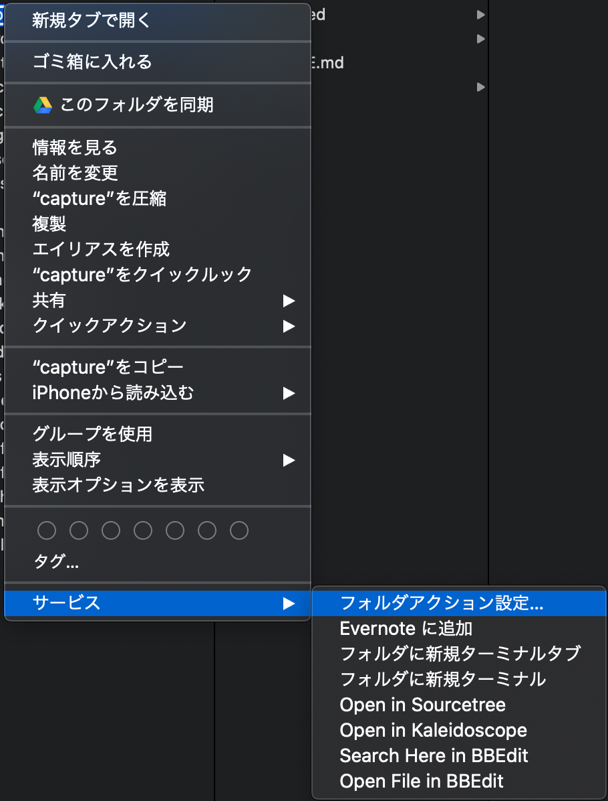
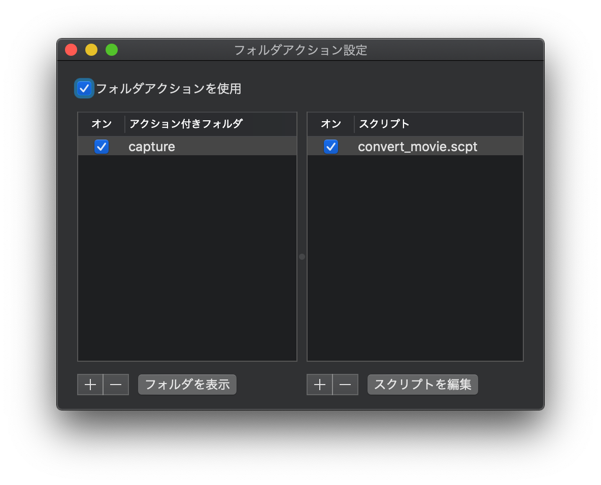
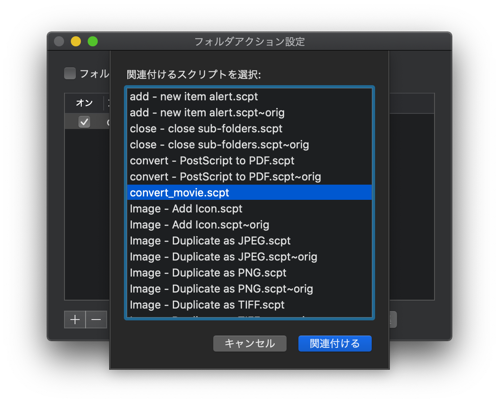

# Auto movie converter (.mov → .gif)

With macOS Mojave, press Shift-Command (⌘)-5 on your keyboard to see all the controls you need to record video and capture still images of your screen.

But made these files are `.mov` format.
A blog or pull request can't receive `.mov` files.
You need to convert these files and then upload.

This script converts automatically and eliminate troublesomeness of converting from `.mov` file to `.gif` file by yourself.

# Require

- ffmpeg
- python3

# Installation

## Clone and resolve paths

Clone this repository to `~/workspace/capture/`

`"~/workspace/capture/"` is my script location.

Please change a suitable location.

scripts/convert.sh

```
~/.pyenv/shims/python convert.py
```

I have no idea why I must write with full path. Please change where python is installed.

## Make Custom Apple Script

- Launch Script Editor in `/Applications/Utilites/`

- create a custom apple script

```
property dialog_timeout : 30 -- set the amount of time before dialogs auto-answer.

on adding folder items to this_folder after receiving added_items
	try
		do shell script "~/workspace/capture/scripts/convert.sh"
	end try
end adding folder items to
```

Please change your location.

This script execute `convert.sh` when a file is added `~/workspace/capture/`

## Setup Custom Apple Script

- copy a made script to the under path.

```
/Library/Scripts/Folder Action Scripts
```

- connect a apple script with `~/workspace/capture/` folder.







## References

- [How to record the screen on your Mac](https://support.apple.com/en-us/HT208721)
- [Creating a Script](https://developer.apple.com/library/archive/documentation/LanguagesUtilities/Conceptual/MacAutomationScriptingGuide/CreateaScript.html#//apple_ref/doc/uid/TP40016239-CH12-SW1)
- [Mac Automation Scripting Guide](https://developer.apple.com/library/archive/documentation/LanguagesUtilities/Conceptual/MacAutomationScriptingGuide/GettoKnowScriptEditor.html#//apple_ref/doc/uid/TP40016239-CH5-SW1)

# License

MIT License

Copyright (c) 2020 Masanao Imai mailto:masa7351@gmail.com
